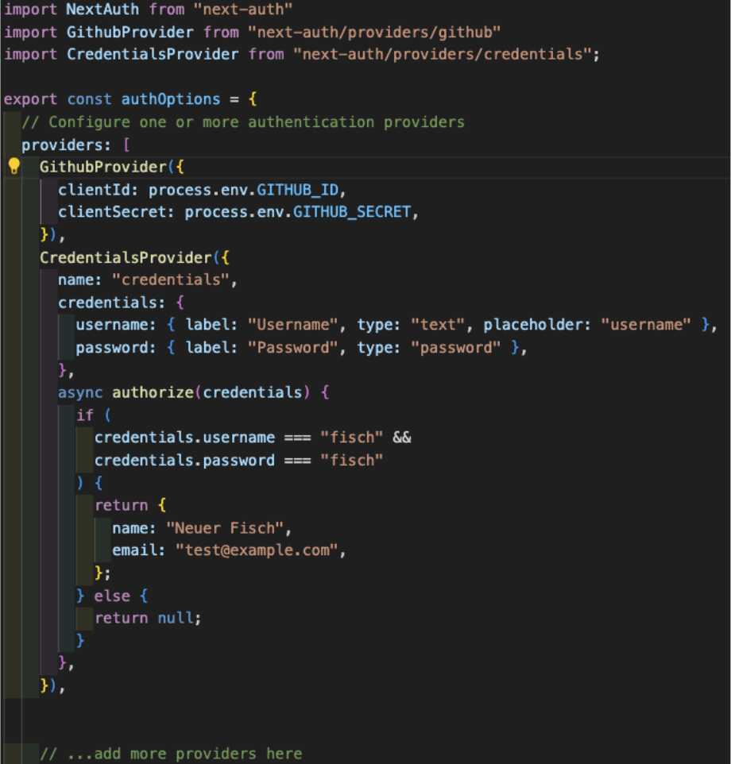

# Workshop Next-Auth

In this project you will use a Tourio App. If you want to work with this repo you will need a `.env.local` file with your personal connection string `MONGODB_URI=<yourConnectionString>` and in your MongoDB you need a database called `tourio` that includes some sample data. You can find some sample data in `/lib/db.json`

## Use of this repo

To use next-auth there are five chapters:

1. Register O-Auth-App at github (see below)
2. Basic Setup
3. Save frontend
4. Save backend
5. Personalize the data

You will find the implementation of chapter 2 to chapter 5 in single commits so you can focus on the changes

### Chapter 1 - Register a OAuth-App at github

GITHUB_ID und GITHUB_SECRET besorgen:

auf github-profil: settings -> Developer Settings -> OAuth-Apps -> new OAuth App:

- Application Name eingeben
- Homepage eingeben: entweder "http://localhost:3000" oder die URL des Vercel-Deployment
- Authorization Callback URL: hier die API route wie folgt:
  "http://localhost:3000/api/auth/callback/github" (bzw. "vercel-deployment/api/auth/callback/github")
- Register Application
- CLIENT ID kopieren und ins Projekt als GITHUB_ID einfügen
- Generate new CLient secret
- CLIENT secret kopieren und ins Projekt als GITHUB_SECRET einfügen

Achtung:
Die OAuth App ist immer nur für EINE URL eingetragen, d.h. ihr müsst eine OAuth App für eure Testumgebung
(localhost) erstellen und eine weitere für euer Vercel-Deployment.
Genau genommen müsst ihr sogar für jeden PR eine OAuth App eintragen, denn Vercel erzeugt für jeden PR
eine neue URL. Um dieses Problem zu umgehen, könnt ihr in der Config ([...nextauth].js) neben dem github provider
auch einen CredentialsProvider (Anmeldung per username und password) einrichten:



Dann kann jeder zum reviewen und testen diesen user und passwort verwenden.

### Chapter 2: Basic Setup

(siehe docs `Getting Started`)

- npm installl next-auth
- API route festlegen:
  - pages/api/auth/[...nextauth].js
  - (den code aus den docs entnehmen)
- den Session-Context bereitstellen:
  - in pages/\_app.js:

```js
import { sessionProvider } from "next-auth/react";
// und um die ganze app legen:
<SessionProvider session={pageProps.session}>
  <Component {...pageProps} />
</SessionProvider>;
```

(Auf diese Weise muss die session nicht erst aus den pageProps destructured werden, wie es in den docs (Zeile 5) gezeigt wird)

### Chapter 3: Login bauen und useSession hook verwenden

(siehe docs `Getting Started`)

```js
import { useSession, signIn, signOut } from "next-auth/react";
// Für login den code aus den docs verwenden
// die session destructuren:
const { data: session } = useSession();
// und conditional rendern:
{ session && <irgendeineKomponente>}
```

### Chapter 4: Backend sichern

(siehe docs `Configuration -> Options`)

1. Damit Backend und Frontend die Sessiondaten sicher austauschen können, brauchen sie eine NEXTAUTH_URL und ein NEXTAUTH_SECRET. Diese müssen in der `.env.local` hinterlegt sein:

NEXTAUTH_URL: Die URL deiner Seite, z.B. http://localhost:3000

Das secret kannst du selbst festlegen. Am sichersten erzeugst du dir eins im Terminal mit folgendem Befehl: `openssl rand -base64 32`. Den erzeugten String kopierst du dir und speicherst ihn im projekt unter dem Namen NEXTAUTH_SECRET

2. Für das BAckend stellt next-auth eigene Methoden zur Verfügung:

in `pages/api/place/index.js`:

```js
import { getServerSession } from "next-auth/next";
import { authOptions } from "../auth/[...nextauth]";
// in der handler function:
const session = await getServerSession(request, response, authOptions);
// und dann conditional actions:
if (session) {
  doSomething;
} else {
  doSomethingElse;
}
```

### Chapter 5: Daten personalisieren:

1. Das Model anpassen:
   in `db/models/Place.js`

```js
//...
author: String,
//...
```

2. den POST request anpassen:

```js
const place = new Place({ ...placeData, author: session.user.email });
```

3. den GET request anpassen:

```js
if (session){
    const places = await Place.find({author: session.user.email});
    return response.status(200).json(places);
}else{
    const places = await Place.find();
    return response.status(200).json(places);
}


### Scripts

You can use the following commands:

- `npm run dev` to start a development server
- `npm run build` to build the project
- `npm run start` to start a production server
- `npm run test` to run the tests
- `npm run lint` to run the linter
```
